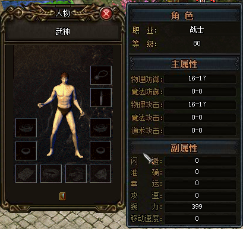

## GamePlayer
- GamePlayer struc ; (sizeof=0xABC, align=0x4, copyof_2029)

|  offset  |             member             |                size/type                 |
| :------: | :----------------------------: | :--------------------------------------: |
| 00000000 |          baseclass_0           |    [GameOtherPlayer](GameOtherPlayer)    |
| 00000794 |         m_equipAttrib          |            PlayerEquipAttrib             |
| 000007C8 |           m_pSprHum            |                    dd                    |
| 000007CC |           m_pSprHair           |                    dd                    |
| 000007D0 |          m_pSprWeapon          |                    dd                    |
| 000007D4 |          m_pSprState           |                    dd                    |
| 000007D8 |           m_pSprMgc            |                    dd                    |
| 000007DC |             m_bag              |                PlayerBag                 |
| 00000814 |            m_indexs            |           PlayerTexIndexTable            |
| 0000081A |               -                |                    db                    |
| 0000081B |               -                |                    db                    |
| 0000081C |          m_atkTarget           |                    dd                    |
| 00000820 |            m_nMapID            |                    dd                    |
| 00000824 |        m_stMagicDetail         |             MagicDetail[25]              |
| 000009B4 |          m_xInputMap           | `std::map<char,MagicDetail*,std::less<char>,std::allocator<std::pair<char const ,MagicDetail *> > >` |
| 000009D4 |         m_xAccInputMap         | ` std::map<char,MagicDetail *,std::less<char>,std::allocator<std::pair<char const ,MagicDetail *> > > ` |
| 000009F4 |          m_bIsLocked           |                    db                    |
| 000009F5 |               -                |                    db                    |
| 000009F6 |               -                |                    db                    |
| 000009F7 |               -                |                    db                    |
| 000009F8 |          m_dwLockType          |                    dd                    |
| 000009FC |       m_dwLastLockedTime       |                    dd                    |
| 00000A00 |        m_bIsWalkLocked         |                    db                    |
| 00000A01 |                                |                    db                    |
| 00000A02 |                                |                    db                    |
| 00000A03 |                                |                    db                    |
| 00000A04 |     m_dwLastLockedWalkTime     |                    dd                    |
| 00000A08 |          m_pMgcTarget          |                    dd                    |
| 00000A0C |      m_dwLastUseMagicTime      |                    dd                    |
| 00000A10 |          m_nSaveIndex          |                    dd                    |
| 00000A14 |          m_szSaveName          |                 char[20]                 |
| 00000A28 |         m_xMgcHistory          | `std::map<unsigned long,unsigned long,std::less<unsigned long>,std::allocator<std::pair<unsigned long const ,unsigned long> > >` |
| 00000A48 |        m_xDrugCoolDown         |            CoolDownController            |
| 00000A68 |            m_xQuest            |               QuestContext               |
| 00000A7C |          m_szNameCopy          |                 char[20]                 |
| 00000A90 |             m_uUID             |                    dd                    |
| 00000A94 |         m_nAccMagicID          |                    dd                    |
| 00000A98 |        m_bUsingPreLock         |                    db                    |
| 00000A99 |                                |                    db                    |
| 00000A9A |                                |                    db                    |
| 00000A9B |                                |                    db                    |
| 00000A9C |        m_xNormalAtkRand        |              RandGenerator               |
| 00000AA0 | m_dwPreCalcNormalAttackEffMask |                    dd                    |
| 00000AA4 |        m_bEnableLieHuo         |                    db                    |
| 00000AA5 |      m_bEnableSuperLieHuo      |                    db                    |
| 00000AA6 |        m_bEnableBanYue         |                    db                    |
| 00000AA7 |         m_bEnableCiSha         |                    db                    |
| 00000AA8 |        m_bEnableKtSword        |                    db                    |
| 00000AA9 |                                |                    db                    |
| 00000AAA |                                |                    db                    |
| 00000AAB |                                |                    db                    |
| 00000AAC |      m_nWaitServerRspType      |                    dd                    |
| 00000AB0 |  m_dwWaitServerRspTimeoutTime  |                    dd                    |
| 00000AB4 |         m_nDonateLeft          |                    dd                    |
| 00000AB8 |      m_bRequestSmallQuit       |                    db                    |
| 00000AB9 |                                |                    db                    |
| 00000ABA |                                |                    db                    |
| 00000ABB |                                |                    db                    |

## GameOtherPlayer
- GameOtherPlayer struc (sizeof=0x794, align=0x4, copyof_1983)

|  offset  |           member            |                size/type                 |
| :------: | :-------------------------: | :--------------------------------------: |
| 00000000 |         baseclass_0         |         [GameObject](GameObject)         |
| 000001E8 |           m_equip           |              ItemAttrib[13]              |
| 000006C8 |          m_fDetect          |                    dd                    |
| 000006CC |     m_fMoveOffsetXTotal     |                    dd                    |
| 000006D0 |     m_fMoveOffsetYTotal     |                    dd                    |
| 000006D4 |     m_fLastUpdateSkill      |                    dd                    |
| 000006D8 |     m_fLastUpdateAttack     |                    dd                    |
| 000006DC |     m_fLastUpdateDeath      |                    dd                    |
| 000006E0 | m_fLastUpdateAttackNoWeapon |                    dd                    |
| 000006E4 |   m_fLastUpdateAttackStop   |                    dd                    |
| 000006E8 |    m_fLastUpdateAttacked    |                    dd                    |
| 000006EC |    m_fLastUpdateMove dd     |                                          |
| 000006F0 |          m_eEffect          |                 dd 4 dup                 |
| 00000700 |       m_pMagicEffect        |                    dd                    |
| 00000704 |     m_pEffectRender dd      |                                          |
| 00000708 |       m_bPlayOneStep        |                    db                    |
| 00000709 |       m_bPlayTwoStep        |                    db                    |
| 0000070A |           m_bJob            |                    db                    |
| 0000070B |             db              |                undefined                 |
| 0000070C |     m_dwLastAttackTime      |                    dd                    |
| 00000710 |   m_dwLastAttackStopTime    |                    dd                    |
| 00000714 |     m_dwLastAttackMode      |                    dd                    |
| 00000718 |        m_xHumStates         | `std::list<MagicElement*,std::allocator<MagicElement *> >` |
| 00000734 |    m_dwJinGangExpireTime    |                    dd                    |
| 00000738 |     m_nLieHuoSkillLevel     |                    dd                    |
| 0000073C |         m_nVipLevel         |                    dd                    |
| 00000740 | m_dwLastNameColorChangeTime |                    dd                    |
| 00000744 |    m_nLastNameColorIndex    |                    dd                    |
| 00000748 |        m_xSkillInfo         | `std::map<unsigned long,unsigned long,std::less<unsigned long>,std::allocator<std::pair<unsigned long const ,unsigned long> > >` |
| 00000768 |        m_stExtAttrib        |             ExtendHeroAttrib             |
| 00000794 |    GameOtherPlayer ends     |                                          |

## GameObject
- GameObject struc (sizeof=0x1E8, align=0x4, copyof_1936)

|  offset  |         member         |                size/type                 |
| :------: | :--------------------: | :--------------------------------------: |
| 00000000 |      baseclass_0       |               RenderObject               |
| 00000028 |      baseclass_28      |              PacketHandler               |
| 00000030 |        m_fPosx         |                    dd                    |
| 00000034 |        m_fPosy         |                    dd                    |
| 00000038 |        m_ptPos         |                 tagPOINT                 |
| 00000040 |         m_type         |                    dd                    |
| 00000044 |         m_drt          |                    dd                    |
| 00000048 |         m_sex          |                    dd                    |
| 0000004C |         m_stat         |                    dd                    |
| 00000050 |       m_preStat        |                    dd                    |
| 00000054 |        m_attrib        |                ItemAttrib                |
| 000000B4 |    m_fLastStandTime    |                    dd                    |
| 000000B8 |     m_bRenderName      |                    db                    |
| 000000B9 |        m_bHurt         |                    db                    |
| 000000BA |                        |                    db                    |
| 000000BB |                        |                    db                    |
| 000000BC | m_nCurrentTextureIndex |                    dd                    |
| 000000C0 | m_nCurrentSelectIndex  |                    dd                    |
| 000000C4 |     m_rcSelectRect     |                 tagRECT                  |
| 000000D4 |       m_szSaying       |                  dw[80]                  |
| 00000174 |     m_fSayingTime      |                    dd                    |
| 00000178 |     m_stSayingSize     |                 tagSIZE                  |
| 00000180 |     m_dwLineNumber     |                    dd                    |
| 00000184 |    m_dwSayingColor     |                    dd                    |
| 00000188 |   m_dwHumEffectFlag    |                    dd                    |
| 0000018C |   m_dwHumEffectTime    |                  dd[7]                   |
| 000001A8 |       m_pMaster        |                    dd                    |
| 000001AC |     m_szMasterName     |                  db[20]                  |
| 000001C0 |   m_bTransparentMode   |                    db                    |
| 000001C1 |                        |                    db                    |
| 000001C2 |                        |                    db                    |
| 000001C3 |                        |                    db                    |
| 000001C4 |     m_eRenderMode      |                    dd                    |
| 000001C8 |    m_dwLastMoveTime    |                    dd                    |
| 000001CC |  m_xAttackNumberList   | `std::list<EffectAttackNumber *,std::allocator<EffectAttackNumber *> >` |
| 000001E8 |       GameObject       |                   ends                   |

## ItemAttrib
- ItemAttrib      struc ; (sizeof=0x60, align=0x4, mappedto_958)

|  member  |      offset      |   size   |
| :------: | :--------------: | :------: |
| 00000000 |        id        |    dd    |
| 00000004 |       name       | char[20] |
| 00000018 |      lucky       |    db    |
| 00000019 |      curse       |    db    |
| 0000001A |       hide       |    db    |
| 0000001B |     accuracy     |    db    |
| 0000001C |     atkSpeed     |    db    |
| 0000001D |     atkPalsy     |    db    |
| 0000001E |     atkPois      |    db    |
| 0000001F |    moveSpeed     |    db    |
| 00000020 |      weight      |    db    |
| 00000021 |     reqType      |    db    |
| 00000022 |     reqValue     |    db    |
| 00000023 |       sex        |    db    |
| 00000024 |       type       |    db    |
| 00000025 |                  |    db    |
| 00000026 |      maxDC       |    dw    |
| 00000028 |      DC 攻击       |    dw    |
| 0000002A |      maxAC       |    dw    |
| 0000002C |     AC 物理防御力     |    dw    |
| 0000002E |      maxMAC      |    dw    |
| 00000030 |    MAC 魔法防御力     |    dw    |
| 00000032 |      maxSC       |    dw    |
| 00000034 |      SC 道术       |    dw    |
| 00000036 |      maxMC       |    dw    |
| 00000038 |      MC 魔法       |    dw    |
| 0000003A |                  |    db    |
| 0000003B |                  |    db    |
| 0000003C |      maxHP       |    dd    |
| 00000040 |        HP        |    dd    |
| 00000044 |      maxMP       |    dd    |
| 00000048 |        MP        |    dd    |
| 0000004C |     maxEXPR      |    dd    |
| 00000050 |     EXPR 经验      |    dd    |
| 00000054 |      level       |    dw    |
| 00000056 |      extra       |    dw    |
| 00000058 |       tex        |    dw    |
| 0000005A |      price       |    dw    |
| 0000005C |       tag        |    dd    |
| 00000060 | ItemAttrib  ends |          |

## PlayerEquipAttrib
- PlayerEquipAttrib struc ; (sizeof=0x34, align=0x4, copyof_1984)

|  offset  |         member         | size/type |
| :------: | :--------------------: | :-------: |
| 00000000 |        nWeapon         |    dd     |
| 00000004 |         nCloth         |    dd     |
| 00000008 |         nNeck          |    dd     |
| 0000000C |         nBrac          |   dd[2]   |
| 00000014 |         nRing          |   dd[2]   |
| 0000001C |         nHelm          |    dd     |
| 00000020 |         nMedal         |    dd     |
| 00000024 |          nGem          |    dd     |
| 00000028 |         nShoe          |    dd     |
| 0000002C |         nBelt          |    dd     |
| 00000030 |       nHairStyle       |    dd     |
| 00000034 | PlayerEquipAttrib ends |           |

## MagicDetail
- MagicDetail     struc ; (sizeof=0x10, align=0x4, copyof_1992)

|  offset  |      member      | size/type |
| :------: | :--------------: | :-------: |
| 00000000 |       cKey       |    db     |
| 00000001 |     cAccKey      |    db     |
| 00000002 |        db        | undefined |
| 00000003 |        db        | undefined |
| 00000004 |      szName      |    dd     |
| 00000008 |     dwTrain      |    dd     |
| 0000000C |      cLevel      |    db     |
| 0000000D |                  |    db     |
| 0000000E |       wID        |    dw     |
| 00000010 | MagicDetail ends |           |


## ExtendHeroAttrib
- ExtendHeroAttrib struc ; (sizeof=0x2C, align=0x4, copyof_5615)

|  offset  |        member         | size/type |
| :------: | :-------------------: | :-------: |
| 00000000 |         uHair         |    db     |
| 00000001 |         uWing         |    db     |
| 00000002 |    uSmeltOreLevel     |    db     |
| 00000003 |                       |    db     |
| 00000004 |     uSmeltOreExp      |    dw     |
| 00000006 |    uSmeltWoodLevel    |    db     |
| 00000007 |                       |    db     |
| 00000008 |     uSmeltWoodExp     |    dw     |
| 0000000A |   uSmeltClothLevel    |    db     |
| 0000000B |                       |    db     |
| 0000000C |    uSmeltClothExp     |    dw     |
| 0000000E |    uSmeltGemLevel     |    db     |
| 0000000F |                       |    db     |
| 00000010 |     uSmeltGemExp      |    dw     |
| 00000012 |    uMakeEquipLevel    |    db     |
| 00000013 |                       |    db     |
| 00000014 |     uMakeEquipExp     |    dw     |
| 00000016 |                       |    db     |
| 00000017 |                       |    db     |
| 00000018 |      uChatColor       |   dd ?    |
| 0000001C |      uClothLook       |    dd     |
| 00000020 |      uWeaponLook      |    dd     |
| 00000024 |      uNameFrame       |    dd     |
| 00000028 |      uChatFrame       |    dd     |
| 0000002C | ExtendHeroAttrib ends |           |

## 成果展示：

经过上述分析，做了个客户端辅助，通过按键精灵：


自己道士玩得多，所以功能也弄得多，不过战士能自动打怪后，挂机比战士轻松太多。
PS：有几次开着这辅助玩LOL，被封了两次三天的号        拳头爸爸，我没用LOL外挂啊  TT

## GameSvr逆向笔记

- 找全局变量

  > 找到了全局经验表，以及加密经验表的mask的地址，由于没有ALSR，所以配合cheatengine一小段lua脚本，让所有的升级经验都为1，可惜了，游戏就这么毁了。
  >
  > - EXPRTableMask 2DD2F0 (2.10.18)
  >
  > - EXPRTable 2CA570 (2.10.18)  
  >
  > - 加密算法是异或
  >   直接IDA修改数据是不行的，可能有一些检查和验证机制，但是cheatengine该加密后的数据是可行的。

- 很遗憾，后来经过查验，上面的地址是会变的，原因应该是基址发生变化，好在cheatengine支持符号作为地址，可以很容易找到所有的地址。

  ### IDA分析出的所有符号列表：

  - `gamesvr.g_bGlobalEncrypt`      标识全局数据是否加密
  - `gamesvr.g_nExprTable`           经验表
  - `gamesvr.g_nHPTable`               每级HP表
  - `gamesvr.g_nMPTable`               每级MP表
  - `gamesvr.g_nWanLiTable`           每级腕力表
  - `gamesvr.g_pxHeros`                 当前在线用户列表  指针类型
  - `gamesvr.g_xMagicInfoTable`     角色技能表
  - `gamesvr.g_xUserInfoList`         暂时没研究

##  服务端GameObject

- GameObject      struc ; (sizeof=0x1D8, align=0x4, copyof_753)

|  offset  |          member          |                size/type                 |
| :------: | :----------------------: | :--------------------------------------: |
| 00000000 |       baseclass_0        |                LockObject                |
| 0000001C |          m_uID           |                    dd                    |
| 00000020 |     m_dwLastExeTime      |                    dd                    |
| 00000024 |     m_dwTotalExeTime     |                    dd                    |
| 00000028 |         m_eType          |        dd enum SERVER_OBJECT_TYPE        |
| 0000002C |     m_dwLastMoveTime     |                    dd                    |
| 00000030 |    m_dwLastAttackTime    |                    dd                    |
| 00000034 |    m_dwLastDeathTime     |                    dd                    |
| 00000038 |         m_stData         |                 UserData                 |
| 000000B0 |       m_xMsgQueue        |                ByteBuffer                |
| 000000C4 |     m_dwLastWalkTime     |                    dd                    |
| 000000C8 |     m_dwWalkInterval     |                    dd                    |
| 000000CC |    m_dwLastStruckTime    |                    dd                    |
| 000000D0 |     m_dwLastDeadTime     |                    dd                    |
| 000000D4 |    m_dwLastSearchTime    |                    dd                    |
| 000000D8 |     m_dwLastRunTime      |                    dd                    |
| 000000DC |     m_dwRunInterval      |                    dd                    |
| 000000E0 |     m_dwCurrentTime      |                    dd                    |
| 000000E4 |  m_wLastValidPositionX   |                    dw                    |
| 000000E6 |  m_wLastValidPositionY   |                    dw                    |
| 000000E8 |      m_dwHumEffFlag      |                    dd                    |
| 000000EC |      m_dwHumEffTime      |               dd 11 dup(?)               |
| 00000118 |        m_dwSupply        |               dd 8 dup(?)                |
| 00000138 |      m_dwHealSupply      |               dd 4 dup(?)                |
| 00000148 |  m_dwEnergyShieldSupply  |               dd 4 dup(?)                |
| 00000158 |    m_dwLastIncHPTime     |                    dd                    |
| 0000015C |  m_dwLastHealIncHPTime   |                    dd                    |
| 00000160 |    m_dwLastIncMPTime     |                    dd                    |
| 00000164 |      m_dwACInrease       |                    dd                    |
| 00000168 |        m_dwPoison        |                    dd                    |
| 0000016C | m_dwLastUpdatePoisonTime |                    dd                    |
| 00000170 |   m_dwLastAddHpMpTime    |                    dd                    |
| 00000174 |      m_dwDefectTime      |                    dd                    |
| 00000178 |         m_pValid         |                    dd                    |
| 0000017C |  m_dwLastCheckValidTime  |                    dd                    |
| 00000180 |     m_bStoneRestore      |                    db                    |
| 00000181 |                          |                    db                    |
| 00000182 |                          |                    db                    |
| 00000183 |                          |                    db                    |
| 00000184 |      m_pStatusCtrl       |                    dd                    |
| 00000188 |        m_xStates         |             StateController              |
| 000001A8 | m_dwInvalidMsgQueueTimes |                    dd                    |
| 000001AC |     m_bNetDataValid      |                    db                    |
| 000001AD |                          |                    db                    |
| 000001AE |                          |                    db                    |
| 000001AF |                          |                    db                    |
| 000001B0 |    m_nTotalRecvDamage    |                    dd                    |
| 000001B4 |       m_bCanPosion       |                    db                    |
| 000001B5 |                          |                    db                    |
| 000001B6 |                          |                    db                    |
| 000001B7 |                          |                    db                    |
| 000001B8 |  m_dwHPRecoverInterval   |                    dd                    |
| 000001BC |     m_xDelayActions      | `std::list<DelayActionBase *,std::allocator<DelayActionBase *>` |
| 000001D8 |   GameObject      ends   |                                          |
## UserData
- UserData struc ; (sizeof=0x78, align=0x4, copyof_1460)

|  offset  |    member    |     size/type     |
| :------: | :----------: | :---------------: |
| 00000000 |   stAttrib   | ItemAttrib   同客户端 |
| 00000060 |   wCoordX    |        dw         |
| 00000062 |   wCoordY    |        dw         |
| 00000064 |    wMapID    |        dw         |
| 00000066 |  undefined   |        db         |
| 00000067 |  undefined   |        db         |
| 00000068 | eServerState |        dd         |
| 0000006C |  eGameState  |        dd         |
| 00000070 |     nDrt     |        dd         |
| 00000074 |     bJob     |        db         |
| 00000075 |      -       |        db         |
| 00000076 |      -       |        db         |
| 00000077 |      -       |        db         |

## 属性加解密函数
- DecryptValue
```c
unsigned int __cdecl DecryptValue(unsigned int _mask, unsigned int _value)
{
  unsigned int _valuea; // [sp+10h] [bp+Ch]@10
  unsigned int _valueb; // [sp+10h] [bp+Ch]@19

  if ( _mask >= 0xFF )
  {
    if ( _mask >= 0xFFFF )
    {
      if ( _mask < 0xFFFFFFFF && _value & 0x8000000 )
      {
        if ( _value & 0x40000000 )
          _valueb = _value & 0xBFFFFFFF;
        else
          _valueb = _value | 0x40000000;
        if ( _valueb & 0x80000 )
          _value = _valueb & 0xFFF7FFFF;
        else
          _value = _valueb | 0x80000;
      }
    }
    else if ( _value & 0x4000 )
    {
      if ( _value & 0x1000 )
        _valuea = _value & 0xFFFFEFFF;
      else
        _valuea = _value | 0x1000;
      if ( _valuea & 0x40 )
        _value = _valuea & 0xFFFFFFBF;
      else
        _value = _valuea | 0x40;
    }
  }
  else if ( _value & 0x80 )
  {
    if ( _value & 0x20 )
      _value &= 0xFFFFFFDF;
    else
      _value |= 0x20u;
  }
  return _mask ^ _value;
}
```
- EncryptValue
```c
  unsigned int __cdecl EncryptValue(unsigned int _mask, unsigned int _value)
  {
    unsigned int _valuea; // [sp+10h] [bp+Ch]@1
    unsigned int _valueb; // [sp+10h] [bp+Ch]@10
    unsigned int _valuec; // [sp+10h] [bp+Ch]@19

    _valuea = _mask ^ _value;
    if ( _mask >= 0xFF )
    {
      if ( _mask >= 0xFFFF )
      {
        if ( _mask < 0xFFFFFFFF && _valuea & 0x8000000 )
        {
          if ( _valuea & 0x40000000 )
            _valuec = _valuea & 0xBFFFFFFF;
          else
            _valuec = _valuea | 0x40000000;
          if ( _valuec & 0x80000 )
            _valuea = _valuec & 0xFFF7FFFF;
          else
            _valuea = _valuec | 0x80000;
        }
      }
      else if ( _valuea & 0x4000 )
      {
        if ( _valuea & 0x1000 )
          _valueb = _valuea & 0xFFFFEFFF;
        else
          _valueb = _valuea | 0x1000;
        if ( _valueb & 0x40 )
          _valuea = _valueb & 0xFFFFFFBF;
        else
          _valuea = _valueb | 0x40;
      }
    }
    else if ( _valuea & 0x80 )
    {
      if ( _valuea & 0x20 )
        _valuea &= 0xFFFFFFDF;
      else
        _valuea |= 0x20u;
    }
    return _valuea;
  }
```

 ### 成果展示：

找到经验表，找到经验Mask，把所有升级经验都置为1，不到5分钟，一个80级新手村号诞生了！



